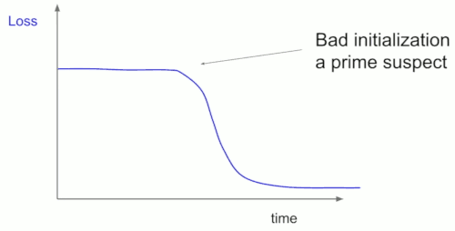

# cs231n_stanford

[lecture video](https://www.youtube.com/watch?v=vT1JzLTH4G4&list=PL3FW7Lu3i5JvHM8ljYj-zLfQRF3EO8sYv)

[syllabus](http://cs231n.stanford.edu/syllabus.html)


- Project
    - [project](http://cs231n.stanford.edu/project.html)
    - [project section pdf](https://nbviewer.jupyter.org/github/mebusy/cs231n_stanford/blob/master/slider/sections/section_3_project.pdf)


## 2 Image Classification

- [course note](https://nbviewer.jupyter.org/github/mebusy/cs231n_stanford/blob/master/slider/lecture_2.pdf)
    - [2 Image classification notes](https://cs231n.github.io/classification)
    - [2 linear classification notes](http://cs231n.github.io/linear-classify)
    - [2.5 google cloud tutorial](https://github.com/cs231n/gcloud)

### K-Nearest Neighobrs

[K-Nearest Neighobrs demo](http://vision.stanford.edu/teaching/cs231n-demos/knn/)

- kNN is an Nonlinear Classifier ?
- L1 distance: ∑|a-b|
- L2 distance: sqrt( ∑(a-b)² )
- K-Nearest Neighobrs: Instead of copying label from nearest neighbor(k=1), take **majority vote** from K closest points
- programming tips
    - To ensure that our vectorized implementation is correct, we make sure that it agrees with the naive implementation. 
    - There are many ways to decide whether two matrices are similar; one of the simplest is the Frobenius norm. 
    - In case you haven't seen it before, the Frobenius norm of two matrices is the square root of the squared sum of differences of all elements; 
    - in other words, reshape the matrices into vectors and compute the Euclidean distance between them.
    ```python
    difference = np.linalg.norm(dists - dists_one, ord='fro')
    print('One loop difference was: %f' % (difference, ))
    if difference < 0.001:
        print('Good! The distance matrices are the same')
    else:
        print('Uh-oh! The distance matrices are different')
    ```
- programming tips
    - to compute L2 distance, directly using numpy vectorized operations may cause huge memory usage
    - the optimization tip is the convert ∑ (a-b)² to ∑a²+ ∑b²- ∑2ab

<details>

<summary>
differences between K-means and K-nearest neighbours
</summary>

These are completely different methods.

- **K-means** is a clustering algorithm that tries to partition a set of points into K sets (clusters) such that the points in each cluster tend to be near each other. 
    - It is unsupervised because the points have no external classification.
- **K-nearest neighbors** is a classification (or regression) algorithm that in order to determine the classification of a point, combines the classification of the K nearest points. 
    - It is supervised because you are trying to classify a point based on the known classification of other points.

</details>


### Hyperparameters

- What is the best value of k to use?
- What is the best distance to use?
- These are **hyperparameters**: choices about the algorithms themselves.

- Setting Hyperparameters
    - Split data into **train**, **val**, and **test**; 
    - choose hyperparameters on **val** 
    - and evaluate on **test**


### Linear Classifier

- Parametric Approach: Linear Classifier
    - Image → f(x,W) → n numbers giving class scores
- 
- bias term
    - if your dataset is unbalanced and had many more cats than dogs for example, then the bias elements corresponding to cat would be higher than the other ones.
- 
-  Example with an image with 4 pixels, and 3 classes (cat/dog/ship)
    - 
- Linear Classifier: Three Viewpoints
    - 


<details>
<summary>
Linear Regression VS Logistic Regression(binary/linear classification)
</summary>

· | Linear Regression | Logistic Regression
--- | --- | ---
outcome | continuous, e.g. y=f(x) | discrete , e.g. 1/0
data fit | is all about fitting a straight line in the data | is about fitting a curve to the data
model | regression | classification
activation function | no | need activation function to convert a linear regression equation to the logistic regression equation
estimation |  It is based on the least square estimation | It is based on maximum likelihood estimation.
application | estimate the dependent variable in case of a change in independent variables. For example, predict the price of houses. | calculate the probability of an event. For example, classify if tissue is benign or malignant.


Q: How do you explain the fact that a logistic regression model can take polynomial predictor variables, e.g. w₁·x² + w₂·x² to produce a non-linear decision boundary?  Is that still a linear classifier ?
A: The concept of "linear classifier" appears to originate with the concept of a linear mode. This polynomial example would be viewed as nonlinear in terms of the given "features" x₁ and x₂, but it would be ***linear*** in terms of features x₁² and x₂³.


</details>

## 3 Loss Function & Optimization

- [course note](https://nbviewer.jupyter.org/github/mebusy/cs231n_stanford/blob/master/slider/lecture_3.pdf)
    - [3 optimization notes](https://cs231n.github.io/optimization-1/)

### Loss Function 

- A **loss function** tells how good our current classifier is
- **Multiclass SVM loss**
    - Lᵢ = ∑<sub>j≠yᵢ</sub> max( 0, sⱼ-s<sub>yᵢ</sub> + 1 )
        - using the score directly ( while softmax classifier converting scores to probabilities )
    - yᵢ is label of sample image xᵢ, it is an integer.  e.g. 0 for cat, 1 for dog
        - s<sub>yᵢ</sub> is the corresponding score for the correct class, and the one that we want it to be the largest one
    - `j≠yᵢ` means skipping the score of correct class, and use it to calculate the loss of reset C-1 scores
        - why? because we like 0 to be the case you’re not losing at all. If we includes j=yᵢ, the minimum loss value will be 1
    - `max( 0, sⱼ-s<sub>yᵢ</sub> + 1 )` , if score was greater than ( *true* score -1 )， calculates the loss， otherwise no loss.
    ```python
    def L_i_vectorized( x, y, W ):
        scores = W.dot(x)
        margins = np.maximum(0, scores - scores[y] + 1)
        margins[y] = 0
        loss_i = np.sum(margins)
        return loss_i

    def svm_loss_vectorized(W, X, y):
        loss = 0.0

        num_train = X.shape[0]
        
        scores = X.dot(W)
        scores_y = np.array([ scores[i,y]  for i,y in enumerate( y ) ]).reshape( num_train,1 )
        margins = np.maximum(0, scores - scores_y + 1)  
        loss = np.sum( margins ) - num_train # ( each sample -1 for the correct label  )
        loss /= num_train
        return loss
    ```
- How do we choose W ?
    - 2 different Ws may have same loss value
    - Regularization.


### Regularization

- some expression about W
- Prevent the model from doing too well on training data
    - Prefer Simpler Models
    - Regularization pushes against fitting the data too well so we don't fit noise in the data
- L2 regularization: R(W) = ∑ W²  (element-wise)
    - L2 regularization likes to "spread out" the weights
- L1 regularization: R(W) = ∑ W   (element-wise)
    - L1 regularization prefers the "sparse" W,  the 0 entries.


### Softmax classifier (Multinomial Logistic Regression)

- interpret raw classifier scores as **probabilities**
- **cross-entropy loss**  (Softmax)
    - 
    - score -> **exp -> normalize** -> -log
- Recap
    - 
        - Andrew NG's course has a little difference in regularization : L = 1/N·( ∑Lᵢ + λR(W) ) 
    - We have a **score function**
    - we have a **loss function**
    - How do we find the best W ?
        - **Optimization**

###  Optimization

- The gradient vector can be interpreted as the "**direction** and rate of fastest increase". 
- The direction of steepest descent is the **negative gradient**
- In practice: 
    - Always use analytic gradient, but check implementation with numerical gradient. This is called a gradient check.
- Gradient Descent
    ```python
    while True:
        weights_grad = evaluate_gradient(loss_fun, data, weights)
        weights += - step_size * weights_grad # perform parameter update
    ```
- Stochastic Gradient Descent (SGD)
    ```python
    # Full sum expensive when N is large!
    # Approximate sum using a minibatch of examples

    # train
    for it in range(num_iters):
        data_batch = sample_training_data ( data, 256) # sample 256 example
        weights_grad = evaluate_gradient(loss_fun, data_batch, weights)  # calculate loss, gradient
        weights += - step_size * weights_grad # perform parameter update

    # predict
    # lable is just the Weight index
    y_pred = X.dot(self.W).argmax( axis = 1 )
    ```
- Softmax loss function gradient
    - 
    - 


## 4. Neural Networks and Backpropagation

- [course note](https://nbviewer.jupyter.org/github/mebusy/cs231n_stanford/blob/master/slider/lecture_4.pdf)

- Problem
    - Linear Classifiers are not very powerful
    - Linear classifiers can only draw linear decision boundaries
    - for the data can not be separated with linear classifer, we can apply feature transform so that those data can be separated by linear classifier.
    - 
    - Neural Networks can do **Feature Extraction** !!

### Neural Networks

- "Neural Network" is a very broad term
    - these are more accurately called "fully-connected networks" or sometimes "multi-layer perceptrons" (MLP)
- Activation functions
    - 
    - ReLU is a good default choice for most problems
    - Softmax is an activation function as well
- Neuron
    - 
    ```python
    class Neuron:
        def neuron_tick(inputs):
            """ assume inputs and weights are 1-D numpy array, and bias is a number"""
            cell_body_sum = np.sum( inputs * self.weights ) + self.bias
            firing_rate = 1.0 / ( 1.0 + math.exp( -cell_body_sum ) )  # sigmoid
            return firing_rate
    ```
- Problem
    - How to compute gradients?
    - Bad Idea: Derive ∇<sub>W</sub>L on paper
        - Not feasible for very complex models!
    - Better Idea: **Computational graphs** + **Backpropagation**
        - once we can express a function using a computational graph, then we can use a technique called `backpropagation` which is going to recursively use the chain rule in order to compute the gradient with respect to every variable in the computational graph.

### Backpropagation

- compute graph example
    - 
    - 
- local gradient
    - 
- Patterns in gradient flow
    - 


### NN Notes

- scores: 
    - forward pass to calculate scores
    - (X₁W₁+b₁) -> ƒ -> (H₂W₂+b₂) -> ƒ -> ... -> (H<sub>n</sub>W<sub>n</sub>+b<sub>n</sub>)
- loss:
    - scores -> softmax/sigmoid/svn loss -> + L2 Regularization
        - **PS.**  the Regularization must apply on Wⱼs of each layer
        ```python
        loss += reg*(W1*W1).sum()  + reg*(W2*W2).sum()
        ```

<details>
<summary>
<b>Example 2 layer NN:  Compute the backward pass, computing the derivatives </b>
</summary>

```python
        # x
        # ·w1 = z1 -> relu -> x2 ( output1_relu )
        # +b1                 ·w2 = z2 -> softmax loss -> z3
        #                     +b2

        # scores_softmax : N,C

        dz3 = 1
        # dz2
        dz2 = scores_softmax.copy()
        dz2[ np.arange( N ), y ] -= 1 # non-linear softmax
        dz2 = dz3 * dz2

        # dw2
        grads["W2"] = output1_relu.T.dot( dz2 )
        grads["W2"] /= N
        grads["W2"] += reg*2*W2

        # db2
        grads["b2"] = np.ones( (1,N) ).dot( dz2 )
        grads["b2"] /= N
        grads["b2"] += reg*2*b2

        # dx2
        dx2 = dz2.dot( W2.T )

        # dz1
        dz1 = output1_relu
        dz1 [ dz1 < 0 ] = 0
        dz1 [ dz1 > 0 ] = 1 # non-linear relu
        dz1 *= dx2

        # dw1
        grads["W1"] = X.T.dot( dz1 )
        grads["W1"] /= N
        grads["W1"] += reg*2*W1

        # db1
        grads["b1"] = np.ones((1,N)).dot( dz1 )
        grads["b1"] /= N
        grads["b1"] += reg*2*b1
```


</details>


## 5. Convolutional Neural Networks

- [course note](https://nbviewer.jupyter.org/github/mebusy/cs231n_stanford/blob/master/slider/lecture_5.pdf)

### Convolution Layer

- image: preserve spatial structure, no flatten
- filters
    - Filters always extend the full depth of the input volume
    - one filter ⇒ one activation map
- **Convolve** the filter with the image
    - i.e. “slide over the image spatially, computing dot products”
    - elementwise multiplication and sum of a filter and the signal(image)

- 

- In practice: Common to zero pad the border,  to keep the activation map same size

### ConvNet

- ConvNet is a sequence of Convolution Layers, interspersed with activation functions
- 
    - one filter ⇒ one activation map
    - **#filters ⇒ depth of convolution Layer**
- Number of parameters for a convolution layer?
    - #parameters of a filter:    #elements of filter  +  1 (bias)
    - #parameters of a convolution layer: ∑ #parameters of all filters in this layer
- Neurons
    - In Fully Connected Layer, Each neuron looks at the full input volume.
    - In ConvNet, E.g. with 5 filters,
        - CONV layer consists of neurons arranged in a 3D grid (WxHx5)
        - There will be 5 different neurons all looking at the same region( fileter size ) in the input volume

### Pooling layer

- makes the representations smaller and more manageable
- operates over each activation map independently:
- 
- max pooling
    - max pool with 2x2 filters and stride 2


## 6 GPU/CPU, TensorFlow/pyTorch

- [course note](https://nbviewer.jupyter.org/github/mebusy/cs231n_stanford/blob/master/slider/lecture_6.pdf)


## 7 Training Neural Networks, Part I

1. One time setup
    - activation functions, preprocessing, weight initialization, regularization, gradient checking
2. Training dynamics
    - transfer learning, babysitting the learning process, parameter updates, hyperparameter optimization
3. Evaluation
    - model ensembles, test-time augmentation

- [course note](https://nbviewer.jupyter.org/github/mebusy/cs231n_stanford/blob/master/slider/lecture_7.pdf)

### Activation Functions

- Sigmoid
    - Historically popular
    - Problem
        - Saturated neurons “kill” the gradients
            - when x is very negative, or a large positive, then these are all regions where the sigmoid function is flat, and it’s going to kill of the gradient, and you’re not going to get a gradient flow coming back.
        - Sigmoid outputs are not zero-centered
            - inefficient for updating. ( e.g. if input is always positive )
        - `exp()` is a bit compute expensive
- tanh
    - zero centered (nice)
    - problem
        - still kills gradients when saturated
- ReLU
    - Computes `f(x) = max(0,x)`
    - Does not saturate (in +region)
    - Very computationally efficient
    - Converges much faster than sigmoid/tanh in practice (e.g. 6x)
    - problem
        - Not zero-centered output
        - An annoyance: what is the gradient when `x < 0` ?
            - dead ReLU will never activat
- Leaky ReLU
    - `f(x) = max( 0.01x,x)`
    - will not "die"
- Exponential Linear Units (ELU)
    - All benefits of ReLU
    - Closer to zero mean outputs
    - Negative saturation regime compared with Leaky ReLU adds some robustness to noise
    - problem
        - Computation requires `exp()`
- Scaled Exponential Linear Units (SELU)
    - Scaled versionof ELU that works better for deep networks
    - “Self-normalizing” property; Can train deep SELU networks without BatchNorm
- Maxout “Neuron”
    - Does not have the basic form of dot product -> nonlinearity
    - Generalizes ReLU and Leaky ReLU
    - Linear Regime! Does not saturate! Does not die!
    - Problem: 
        - doubles the number of parameters/neuron :(
- TLDR: In practice:
    - Use **ReLU**. Be careful with your learning rates
    - Try out Leaky ReLU / Maxout / ELU / SELU
        - To squeeze out some marginal gains
    - Don’t use **sigmoid** or **tanh**


### Data Preprocessing  ( apply on input, for efficient updating )


- Why normalization ?
    - Before normalization: 
        - classification loss very sensitive to changes in weight matrix; hard to optimize
    - After normalization: 
        - less sensitive to small changes in weights; easier to optimize

- Q: is it safe to use sigmoid if we use normalized data?
    - A: 0 mean can solve the problem of sigmoid for only the first layer of neuron network.  we still get this problem in the hidden layers.
- In practice, you may also see **PCA** and **Whitening** of the data
    - 
- TLDR: In practice for Images: center only ( 0 mean only， no normalization, apply both on training set and test set.  )
    - e.g. consider CIFAR-10 example with [32,32,3] images
    - Subtractthemeanimage(e.g.AlexNet) (mean image = [32,32,3] array)
    - Subtract per-channel mean (e.g. VGGNet) (mean along each channel = 3 numbers)

### Weight Initialization ( to keep same variance of input/output )

- Q: what happens when W=constant init is used?
    - A: all neurons are going to do the same thing, and get the same gradient, update in the same way,  so that learn the same thing.
    - But we want neurons to learn different things.
- First idea: Small random numbers
    - aussian with zero mean and 1e-2 standard deviation
        ```python
        W = 0.01 * np.random.randn( Din, Dout)
        x = np.tanh( x.dot(W) )
        ```
    - Works ~okay for small networks, but problems with deeper networks.
        - Q: What will happen to the activations for the last layer? 
        - A: As we multiply by this W, these small numbers at each layer, this quickly shrinks and collapses all of these values.  By the end, we get all of these zeroes. 
    - What if increase std of initial weights from 0.01 to 0.05
        ```python
        W = 0.05 * np.random.randn( Din, Dout)
        x = np.tanh( x.dot(W) )
        ```
        - Q: What will happen to the activations for the last layer?
        - A: All activations saturate. Local gradients all zero, no learning.
- "Xavier” Initialization
    ```python
    W = np.random.randn( Din, Dout) / np.sqrt(Din)
    x = np.tanh( x.dot(W) )
    ```
    - We specify that we **want the variance of the input to be the same as the variance of the output**.
    - Intuitively with this kind of means is that if you have a small number of inputs, then we’re going to divide by the smaller number and get larger weights. We need larger weights because  with small inputs you need a larger weights to get the same larger variance at output.
    - **For conv layers, Din is** filter_size² \* input_channels
    - What about ReLU?
        ```python
        W = np.random.randn( Din, Dout) / np.sqrt(Din)
        x = np.maximum( 0, x.dot(W) )
        ```
        - Because ReLU is kill half of your units, it’s actually halving the variance that you get out of this. You won’t actually get the right variance coming out, it’s going to be too small.
            ```python
            # solve for ReLU
            W = np.random.randn( Din, Dout) * np.sqrt(2/Din)
            x = np.maximum( 0, x.dot(W) )
            # note: here we change division to multiplication, it is same as `/ np.sqrt( Din/2 )`
            >>> 1/np.sqrt( 6/2 )
            0.5773502691896258
            >>> 1*np.sqrt( 2/6 )
            0.5773502691896257
            ```


### Batch Normalization ( to make activations "Gaussian" )

- A related idea of weight initialization,  idea of wanting zero-mean unit-variance activations.
- 
- 
- Learnable scale and shift parameters: γ,β 
    - Learning γ=σ, β=μ will recover the identify function.
- Q: Why do we want to learn this γ,β to be able to learn the identity function back? 
    - A: Because we want to give it the flexibility. 
    - Even though in general BN is a good idea, it’s not always exactly the best thing to do. So maybe we want something little different scale and shift.
    - In practice , the Neuron Network will learning a little different γ,β.
- Where / When to apply Batch Normalization ?
    - Usually inserted after Fully Connected or Convolutional layers, and before nonlinearity.
    - 
- Benefits
    - Makes deep networks **much** easier to train!
    - Improves gradient flow
    - Allows higher learning rates, faster convergence
    - Networks become more robust to initialization
    - Acts as (some) regularization during training
    - Zero overhead at test-time: can be fused with conv!
- Caveat:
    - **Behaves differently during training and testing: this is a very common source of bugs!**


### Transfer learning

- "You need a lot of data if you want to train/use CNNs"
    - BUSTED
- One problem with overfitting is sometimes you overfit becauze you don't have enough data. You want to use a big, powerful model, but that big, powerful model just is gonna overfit too much on your small dataset.
    - Regularization if one way to combat that, but another way is through using transfer learning. 
- **Transfer learing kind of busts this myth. You don't need a huge amount of data** in order to train a CNN.
- The idea is very simple
    - You'll maybe first take some CNN. You'll take your CNN, you'll train it in a very large dataset, like ImageNet, where you actually have enough data to train the whole network.
    - 
    - Now the idea you want to apply the features from this dataset to some small dataset that you care about. 
        - Maybe instead of classifying the 1000 ImageNet categories, now you want to classify like 10 dog breeds, or something like that.
        - 
        - So here our small dataset only has C classes.
    - Then what you'll typically do is for this last fully connected layer (FC-C), you need to reinitialize that matrix randomly( for ImageNet, its 4096x1000, for your new classes, it might be 4096xC ).
        - So you reinitialize this last matrix randomly, freeze the weights of all the previous layers, and now just basically train a linear classifier, and only train the parameters of this last layer. 
    - This tends to work pretty well if you only have a very small dataset to work with. 
    - Now if you have a little bit more data.
        - 

STRATEGY | very similar dataset to (e.g. ImageNet) | very different to (e.g. ImageNet)
--- | --- | ---
**very little data** | Use Linear Classifier on top layer | You're in trouble... Try linear classifier from different stages
**quite a log of data** | Finetune a few layers | Finetune a larger number of layers

- **Transfer Learning with CNNs is pervasive ...**. It's the norm, not an exception.
    - In almost all applications of computer vision these days, most people are not training these things from scratch. Almost always, that CNN will be pretrained on ImageNet, and then potentially fine tuned for the task at hand.
    - Deep learning frameworks provide a "Model Zoo" of pretrained models so you don't need to train you own.
        - TensorFlow:  `/models`
        - PyTorch: `/vision`
    - Utilizing pre-trained model is one way that you can attack a lot of problems in deep learning, even if you don't have a huge dataset of your own.


----


### Babysitting the Learning Process

[Babysitting the learning process/Parameter updates](https://cs231n.github.io/neural-networks-3/)

So now we've defined our network architecture, and we'll talk about how do we monitor training, and how do we adjust hyperparameters as we go to get good learning results? 

- Step 1: Preprocess the data
    - zero-mean
- Step 2: Choose the architecture ( say we start with on hidden layer of 50 neurons ).
    - Double check that the loss is reasonable
        - we know what our loss should be when our weights are small.
        - 
        - now we want to crank up the regularization,  and when we do that, we want to see that our loss goes up, because we've add additional regularization term.
        - 
    - Now start training. Make sure that you can overfit very small portion of the training data.
        - how? turn the regularization to 0 again, add see whether we can make the loss go down to 0. **Very small loss, train accuracy 1.00**.
- Step 3: Now you can take your full training data, but start with small regularization and **find learning rate** that makes the loss go down.
    - **loss not going down**: learning rate too low
    - **loss exploding**: learning rate too high


### Hyperparameter Optimization


- Q: How to pick the best values of all of these hyperparameters ?
    - A: to do cross-validation.
- **Cross-validation strategy**
    - training on your training set, evaluating on a validation set.
- **coarse -> fine** cross-validation in stages
    - **first stage**: only a few epochs to get rough idea of what params work
    - **second stage**: longer running time, finer search ... (repeat as necessary)
- Note: for softmax loss, it'e best to optimize hyperparameters in log space.
    ```python
    max_count = 100
    for count in range(max_count):
        reg = 10 ** uniform(-5,5)
        lr  = 10 ** uniform(-3,-6)
    ```
    - so here instead of sampling uniformly between 0.01 to 100, you're going to actually do 10**(*some range*). This is because the learning rate is multiplying your gradient update.
- Randome Search vs. Grid Search
    - 
    - In practice, it's actualy better to sample from a random layout. So sampling random value of each hyperparameter in a range.
- Monitor and visualize the loss curve
    - 
        - too linear, too flat (blue):  learning rate is too low, it is not changing enough. 
        - there's a steep change, but then a plateau (green):  too high. because in this case, you're taking too large jumps, and you're not able to settle well into your local optimum.
    - 
- Monitor and visualize accuracy
    - 
    - Q: It's bad with a large gap, it means you're overfitting, if there is no gap, is that also maybe bad ? Do we actually want some small, optimal gap between the two ?
        - A:  We don't really care about the gap. What we really care about is maximizing the performance on the validation set. 
        - What tends to happen is that if you don't see a gap, then you could have improved your absolute performance by overfitting a little bit more.  There's weird correlation between the absolute performance on the validation set and the size of that gap. We only care about absolute performance.
- Track the ratio of weight updates / weight magnitudes:
    ```python
    # assume parameter vector W and its gradient vector dW
    param_scale = np.linalg.norm( W.ravel() )
    update = - learning_rate * dW # simple SGD update
    update_scale = np.linalg.norm( update.ravel() )
    W += update # the actual update
    print ( update_scale / param_scale ) # want about 1e-3
    ```
    - ratio between the updates and values: ~ 0.0002/0.02 = 0.01 (about okay)
    - **want this to be somewhere around 0.001 or so**.
    - this is just something that can help you debug what might be a problem.


- More details in course note 8
    - Step 1: Check initial loss
    - Step 2: Overfit a small sample
    - Step 3: Find LR that makes loss go down 
    - Step 4: Coarse grid, train for ~1-5 epochs 
    - Step 5: Refine grid, train longer
    - Step 6: Look at loss curves
    - Step 7: GOTO step 5


### (Fancier) Optimizers

- intuitions about the learning process dynamics
    - 
    - 


## 8. Training Neural Networks, part II

- Improve your training error:
    - (Fancier) Optimizers
    - Learning rate schedules
- Improve your test error:
    - Regularization
    - Choosing Hyperparameters

- [course note /  Choosing Hyperparameters](https://nbviewer.jupyter.org/github/mebusy/cs231n_stanford/blob/master/slider/lecture_8.pdf)

### Optimization

- Problems with SGD
    - the loss function has a **local minima** or **saddle point** (Saddle points much more common in high dimension)
    - **Zero gradient, gradient descent gets stuck**
- How to solve ?
    - **SGD + Momentum**
        - The idea is that we maintain a velocity over time, and we add our gradient estimates to the velocity. Then we step in the direction of the velocity, rather than stepping in the direction of the gradient.
        - **kind of similar idea in TD learning**
        - imagine the ball rolling down the hill, picking up speed as it comes down. when the ball pass the point of local minima, the point still has velocity even though it doesn’t have gradient. The noise is averaged out.
            - 
    - **AdaGrad**
        - rather than having a velocity term, instead we have a grad squared term, and during training, we’re going to just keep adding the squared gradients to this grad squared term.
        - Progress along “steep” directions is damped; progress along “flat” directions is accelerated
        - THe problem of AdaGrad is the step size(learning rate) decays to 0.
        - in general, we tend not to use AdaGrad so much when training NN.
    - **RMSProp** : “Leaky AdaGrad”
        - why not combine the ideas in Momentum and RMPProp ?
    - **Adam**
        - RMSProp +  momentum + Bias correction
        - Bias correction for the fact that first and second moment estimates start at zero
        - **Adam with beta1 = 0.9, beta2 = 0.999, and learning_rate = 1e-3 or 5e-4 is a great starting point for many models!**


### Improve test error

- Early Stopping: Always do this
    -  Stop training the model when accuracy on the validation set decreases Or train for a long time, but always keep track of the model snapshot that worked best on val
    - 


### Model Ensembles

1. Train multiple independent models
2. At test time average their results
    - Take average of predicted probability distributions, then choose argmax
    - Enjoy 2% extra performance

But How to improve single-model performance ? Regularization!


### Regularization

- Regularization: Dropout
    - In each forward pass, randomly set some neurons to zero Probability of dropping is a hyperparameter; 0.5 is common
        - 
    - It’s more common in fully connected layers, but you sometimes see this in convolutional layers, as well.
- How do Dropout help ?
    - Forces the network to have a redundant representation; Prevents co-adaptation of features
    - For example, 
        - to classify cats, the network might learn that one neuron for having a ear, one neuron for having a tail, one neuron for being furry , and then it can combine these things together to decide whether or not it's a cat.
        - But now if we have drop out, then in making the final decision about catness, the network cannot depend too much on any of these features. Instead, it kind of needs to distribute its idea of catness across many different features. This might help prevent overfitting somehow.
        - 
    - Dropout is training a large ensemble of models (that share parameters). Each binary mask is one model.
        - After you apply dropout, we’re kind of computing this subnetwork using some subset of the neurons. Now every different potential dropout mask leads to a different potential subnetwork. Now dropout is kind of learning a whole ensumble of networks all at the same time that all share parameters.
- Dropout: Test time
    - Dropout makes our output random!
    - We need average the output. **At test time, multiply by dropout probability.**
    - that is, drop in train time, scale at test time.

- Regularization: A common pattern
    - Training: Add some kind of randomness
    - Testing: Average out randomness (sometimes approximate)
    - Examples: 
        - Dropout
        - Batch Normalization 
        - Data Augmentation

- Regularization: Data Augmentation
    - Random mix/combinations of :
        - translation
        - rotation
        - stretching
        - shearing
        - lens distortions, ... (go crazy)
    - Cubuk et al., “AutoAugment: Learning Augmentation Strategies from Data”, CVPR 2019

- Regularization - In practice
    - Consider dropout for large fully-connected layers
    - Batch normalization and data augmentation almost always a good idea


### Summary

- Optimization
    - Momentum, RMSProp, Adam, etc
- Regularization
    - Dropout, etc
- Transfer Learning
    - User this for your projects!


